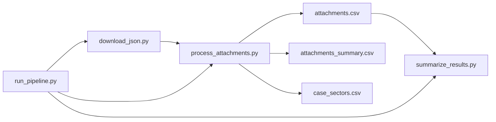

# eu-merger-cases-arbitration-analysis specification

---

## What you are building

A small **Python** project that:

1. Downloads public European Commission data about **merger cases** (JSON).
2. Finds every **PDF attachment** linked from decision data.
3. Downloads each PDF, reads the text, and searches for **arbitration-related words** (in the PDF’s language).
4. Writes **three CSV files**: full attachment rows with PDF results, a slim summary export, and a normalized case-sector lookup table.

**You do not need:** a database, Docker, Airflow, dbt, or a dashboard. Run three scripts manually on your computer (or use `run_pipeline.py`).

**Typical runtime:** downloading and scanning all PDFs takes **several hours** (~11k PDFs). Use `--test-limit` first; for full runs use `--workers` and `--save-every` to speed up (see **Parallel PDF processing** below).

**Python:** 3.10 or newer.

**Project layout:** All scripts live under [`scripts/`](../scripts/):

| Folder | Scripts |
|--------|---------|
| [`scripts/pipeline/`](../scripts/pipeline/) | `download_json.py`, `process_attachments.py`, `summarize_results.py`, `run_pipeline.py`, `pipeline_utils.py`, `pdf_processing.py` |
| [`scripts/analyses/`](../scripts/analyses/) | CSV analysis scripts; output to `data/analysis/*.txt` |

Run all commands from the project root.

---

## Data source

### JSON download URL

```
https://compcases-open-data-portal-files-prod.s3.eu-west-1.amazonaws.com/case-data-M.json
```

Save the file locally as:

```
data/raw/case-data-M.json
```

**What it contains:** one object per merger case (keys like `M.1185`). Each case includes company names, sectors, decisions, and links to PDF documents.

**Validation after download:**

- File must parse as valid JSON.
- At least **1000** top-level case keys (guards against truncated downloads).
- Write to a temporary file first; replace the old file only when validation passes.

### JSON structure (simplified)

```
case_key (e.g. "M.1185")
└── metadata                    → case-level fields (case number, companies, sectors, …)
└── caseAttachments[]           → optional case-level attachments (NOT exported to CSV)
└── decisions[]
    └── metadata                → decision-level fields (decision type, adoption date, …)
    └── decisionAttachments[]   → PDFs belonging to this decision
        └── metadata
            ├── attachmentLink       → URL of the PDF  (required)
            ├── metadataReference    → stable id        (required)
            └── attachmentLanguage   → e.g. EN, DE, FR  (needed for keyword search)
```

**CSV grain:** one row per **`decisionAttachment`** only (one PDF), identified by `attachmentLink` + `metadataReference`.

**Out of scope for CSV rows:** `caseAttachments[]` are ignored — do not flatten them, do not keyword-scan them, and do not use a `caseAtt_` column prefix.

---

## Parsed fixed columns (from JSON metadata)

These four fixed columns are derived during flattening (not copied verbatim from dynamic columns).

### Decision type (`decision_type_code`, `decision_type_label`)

**Source:** `decisions[].metadata.decisionTypes` — a list of JSON strings.

Each list item parses as an object with `code` and `label`:

```json
{"code": "DecisionType310", "label": "Art. 6(1)(b)"}
```

**Parsing rules:**

1. For each item in `decisionTypes`, parse the string as JSON.
2. Collect all `code` values → join with ` | ` → `decision_type_code`.
3. Collect all `label` values → join with ` | ` → `decision_type_label`.
4. If `decisionTypes` is missing or empty: both columns are empty strings.

**Example** (single decision type):

| Field | Value |
|-------|-------|
| `decision_type_code` | `DecisionType310` |
| `decision_type_label` | `Art. 6(1)(b)` |

### Sector (`case_sectors.csv`)

**Not stored on `attachments.csv`.** Case sectors are written to a separate file so each sector is one row (no ` | ` joining).

**Source:** `case.metadata.caseSectors` — a list of JSON strings (case-level).

Each list item parses as an object with `code` and `label`:

```json
{"code": "NaceSectorsH_51_1", "label": "H.51.1 - Passenger air transport"}
```

**Output path:** `data/processed/case_sectors.csv`

**Columns (fixed order):**

| Column | Description |
|--------|-------------|
| `case_caseNumber` | Case number (e.g. `M.10149`); repeated when a case has multiple sectors |
| `case_caseSectors_code` | Full sector code for this row |
| `case_caseSectors_label` | Matching sector label |
| `case_caseSectors_code_level1` | Sector code truncated before the 1st `_` (e.g. `NaceSectorsE`) |
| `case_caseSectors_code_level2` | Truncated before the 2nd `_` (e.g. `NaceSectorsE_38`) |
| `case_caseSectors_code_level3` | Truncated before the 3rd `_` if present (e.g. `NaceSectorsE_38_2`); otherwise same as level 2 |
| `has_keyword_hit` | `1` if the case has at least one keyword hit in `attachments.csv`, else `0` |

**Sector code level parsing** (from `case_caseSectors_code`, split on `_`):

| Full code | level1 | level2 | level3 |
|-----------|--------|--------|--------|
| `NaceSectorsE_38_2_1` | `NaceSectorsE` | `NaceSectorsE_38` | `NaceSectorsE_38_2` |
| `NaceSectorsE_38` | `NaceSectorsE` | `NaceSectorsE_38` | `NaceSectorsE_38` |
| `NaceSectorsG_46` | `NaceSectorsG` | `NaceSectorsG_46` | `NaceSectorsG_46` |

**Parsing rules:**

1. For each case in the JSON, read `caseNumber` (first list value).
2. For each item in `caseSectors`, parse the string as JSON and emit one row with that item’s `code` and `label`.
3. Derive `case_caseSectors_code_level1` … `level3` from the full `code` as above.
4. Set `has_keyword_hit` from attachment rows: `1` when any attachment with the same `case_caseNumber` has `has_keyword_hit = true`, else `0`.
5. Cases with missing or empty `caseSectors` → no rows for that case.
6. Rows are sorted by `case_caseNumber`, then `case_caseSectors_code`, then `case_caseSectors_label`.

**Example** (case `M.10149` with two sectors):

| `case_caseNumber` | `case_caseSectors_code` | `case_caseSectors_label` | `…_level1` | `…_level2` | `…_level3` | `has_keyword_hit` |
|-------------------|-------------------------|--------------------------|------------|------------|------------|-------------------|
| `M.10149` | `NaceSectorsH_51_1` | `H.51.1 - Passenger air transport` | `NaceSectorsH` | `NaceSectorsH_51` | `NaceSectorsH_51_1` | `0` |
| `M.10149` | `NaceSectorsH_50_1` | `H.50.1 - Sea and coastal passenger water transport` | `NaceSectorsH` | `NaceSectorsH_50` | `NaceSectorsH_50_1` | `0` |

**Join to attachments:** use `case_caseNumber` on both files (`attachments.csv` has a `case_caseNumber` column from flattened case metadata).

**Regeneration:** `case_sectors.csv` is rewritten whenever `attachments.csv` is saved (frequency controlled by `--save-every`), so `has_keyword_hit` stays in sync with attachment keyword results.

**Excluded from `attachments.csv`:** `caseSectors` is not flattened into `case_caseSectors_code` / `case_caseSectors_label` on attachment rows. Legacy `sector_code` / `sector_label` fixed columns are also removed.

---

## Keyword configuration

`config/keywords.txt`. Each line defines a search rule:

```
LANG: pattern
```

| Rule | Meaning |
|------|---------|
| `EN: arbitrat*` | English PDFs: match words starting with “arbitrat” (arbitration, arbitral, …) |
| `*` | Wildcard: any characters |
| `DE: Schied*:Verfahren*` | German: **both** patterns must appear (AND), separated by `:` after the language code |
| Two lines with same `LANG` | **OR** — either rule can match |
| `# comment` or blank line | Ignored |

Example lines:

```
EN: arbitrat*
FR: arbitrag*
DE: Schiedsverfahren*
```

The language code must match the PDF’s `attachmentLanguage` field (two letters, e.g. `EN`).

### Keyword file parsing grammar

For each non-blank, non-comment line:

1. Split on the **first** `:` → language code (trimmed, uppercased) and **pattern rest**.
2. Split **pattern rest** on `:` → one or more sub-patterns (AND group). Trim each sub-pattern.
3. Multiple lines with the same language code → **OR** between lines; within one line, sub-patterns are **AND**.

**Example:** `DE: Schied*:Verfahren*` → language `DE`, one AND group with sub-patterns `Schied*` and `Verfahren*`.

**No rules for a PDF language:** log a warning, set `has_keyword_hit = false`, leave `matchedKeywords` / `matchContext` empty, set `matchedLanguage` to the attachment language if known.

---

## Output CSV files

### `attachments.csv`

**Path:** `data/processed/attachments.csv`  
**Encoding:** UTF-8  
**Grain:** one row per decision PDF attachment

**Excel note:** embedded line breaks in cell values are replaced with spaces on write (`sanitize_csv_cell`) so Excel does not split one logical row into multiple physical lines.

#### Fixed columns (always first, in this order)

| Column | Description |
|--------|-------------|
| `att_attachmentLink` | PDF URL |
| `att_metadataReference` | Attachment ID |
| `has_keyword_hit` | `true` if any keyword matched, else `false` |
| `matchedKeywords` | Which patterns matched, joined with ` \| `; empty if no hit |
| `matchedLanguage` | Language used for search; empty if unknown |
| `matchContext` | 150 characters of text around the first match; empty if no hit |
| `pdf_processed_at` | ISO timestamp (UTC) when PDF processing finished |
| `pdf_processing_error` | Empty if OK; `download:…` or `processing:…` if failed |
| `decision_type_code` | Parsed code from `decisionTypes` (see above) |
| `decision_type_label` | Parsed label (e.g. `Art. 6(1)(b)`) |
| `is_active` | `true` if still in latest JSON; `false` if removed |

#### Dynamic metadata columns (after fixed columns)

While reading the JSON, collect **all** metadata field names from case, decision, and attachment metadata and add them as columns:

| Prefix | Comes from |
|--------|------------|
| `case_` | Case metadata |
| `dec_` | Decision metadata |
| `att_` | Attachment metadata |

Rules:

- Store everything as flat text — **no nested JSON in column values**.
- Plain list values (strings, numbers) → one column named after the field; multiple items joined with ` | `.
- Objects shaped like `{"code":"…","label":"…"}` → `{field}_code` and `{field}_label` columns.
- Objects shaped like `{"items":[{…}, …]}` → one column per item property, e.g. `{field}_reference`, `{field}_publishedDate`.
- Other nested objects → one column per property using `{field}_{property}` naming.
- **`dec_decisionNumber` normalization:** store all values as plain text strings. Numeric source values stay as digit strings (e.g. `40398`). GUID-style source values such as `{01760B06-ADDB-4DA5-B8B4-3B32B85DCB75}` are stored without braces, uppercased (e.g. `01760B06-ADDB-4DA5-B8B4-3B32B85DCB75`).
- **`caseSectors` is excluded** from case metadata flattening on attachment rows (sectors live in `case_sectors.csv` only).
- New fields in future JSON releases → new columns on the next run.
- Skip rows missing `attachmentLink` or `metadataReference`.
- **No duplicate columns:** fixed columns win. When flattening attachment metadata, do **not** add dynamic `att_*` columns for keys already represented in the fixed column list (`attachmentLink`, `metadataReference`, and other fixed-derived fields).

### `case_sectors.csv`

**Path:** `data/processed/case_sectors.csv`  
**Encoding:** UTF-8  
**Grain:** one row per case sector (see **Sector (`case_sectors.csv`)** above)

Written on every `process_attachments.py` run from the current JSON. Regenerated whenever `attachments.csv` is saved (after metadata merge and after each PDF) so `has_keyword_hit` stays in sync. Uses the same atomic `.tmp` rename and Excel-safe cell sanitization as `attachments.csv`.

### `attachments_summary.csv`

**Path:** `data/processed/attachments_summary.csv`  
**Encoding:** UTF-8  
**Grain:** one row per decision PDF attachment (same rows as `attachments.csv`)

A fixed-column subset of `attachments.csv` for analysis and Excel use. Regenerated whenever `attachments.csv` is saved (after metadata merge and after each PDF), so `has_keyword_hit` stays in sync.

**Columns (fixed order):**

| Column | Description |
|--------|-------------|
| `att_metadataReference` | Attachment ID |
| `has_keyword_hit` | `true` if any keyword matched, else `false` |
| `decision_type_label` | Parsed decision-type label (e.g. `Art. 6(1)(b)`) |
| `case_caseCompanies` | Case companies |
| `case_caseInitiationDate` | Case initiation date |
| `case_caseLastDecisionDate` | Case last decision date |
| `case_caseInstrument` | Case instrument |
| `case_caseNumber` | Case number (e.g. `M.10149`) |
| `case_caseRegulation` | Case regulation |
| `case_caseSimplified` | Simplified procedure flag |
| `case_caseTitle` | Case title |
| `dec_decisionAdoptionDate` | Decision adoption date |
| `dec_decisionNumber` | Decision number |
| `dec_decisionOfficialJournalPublicationsPublishedDates` | OJ publication dates |
| `dec_decisionTypes_code` | Decision type code(s) from flattened metadata |
| `dec_decisionTypes_label` | Decision type label(s) from flattened metadata |
| `dec_language` | Decision language |
| `dec_metadataReference` | Decision metadata reference |

**Note:** `decision_type_label` is the parsed fixed column from `decisionTypes`; `dec_decisionTypes_code` / `dec_decisionTypes_label` are separate flattened metadata columns and may differ in format (e.g. pipe-joined when multiple types).

---

## Dependencies

**File:** `requirements.txt`

```
requests>=2.31.0
pymupdf>=1.24.0
pdfplumber>=0.11.0
```

- **PyMuPDF** (`fitz`) — primary PDF text extraction (fast).
- **pdfplumber** — fallback extractor when PyMuPDF fails (quality safety net).

Pin exact versions only if reproducibility becomes important; minimum versions above are sufficient for development.

**Standard library only otherwise:** `csv`, `json`, `logging`, `argparse`, `re`, `pathlib`, etc.

---

## Pipeline overview



| Step | Script | What it does |
|------|--------|--------------|
| 1 | `download_json.py` | Fetch JSON from S3 URL, validate, save |
| 2 | `process_attachments.py` | Flatten JSON, write `case_sectors.csv`, download PDFs, keyword scan, write `attachments.csv` and `attachments_summary.csv` |
| 3 | `summarize_results.py` | Print stats, write `summary.json` |
| all | `run_pipeline.py` | Run steps 1 → 2 → 3 in order |

Each script must expose a **`if __name__ == "__main__":`** entry point so it can be run directly with `python script.py`.

Document run order in `README.md`.

### `run_pipeline.py`

Runs the full pipeline in order:

```bash
python scripts/pipeline/run_pipeline.py
python scripts/pipeline/run_pipeline.py --test-limit 100
python scripts/pipeline/run_pipeline.py --retry-downloads
python scripts/pipeline/run_pipeline.py --workers 8 --save-every 50
```

**Behaviour:**

1. Run `download_json.py` logic (or subprocess). On failure: **stop**; do not run later steps.
2. Run `process_attachments.py` with forwarded CLI flags (`--test-limit`, `--retry-downloads`, `--workers`, `--save-every`).
3. Run `summarize_results.py`. On failure: **stop** and exit non-zero.

`--workers` and `--save-every` are forwarded to `process_attachments.py` only.

---

## Script 1: `download_json.py`

**Run:**

```bash
python scripts/pipeline/download_json.py
```

**Behaviour:**

1. `GET` the JSON URL with `requests`.
2. Save to `data/raw/case-data-M.json.tmp`.
3. Validate JSON and case count ≥ 1000.
4. Rename temp file to `data/raw/case-data-M.json`.
5. On failure: delete temp file, keep previous file if any, log error.

**HTTP settings:** 120 s timeout; User-Agent `eu-merger-cases-arbitration-analysis/1.0`; **3 retries** with exponential backoff (1 s, 2 s, 4 s) on transient network/5xx errors.

---

## Script 2: `process_attachments.py` (main work)

**Run:**

```bash
python scripts/pipeline/process_attachments.py
python scripts/pipeline/process_attachments.py --test-limit 100    # smoke test: only 100 PDFs
python scripts/pipeline/process_attachments.py --retry-downloads   # retry failed downloads
python scripts/pipeline/process_attachments.py --workers 8 --save-every 50   # parallel PDFs
```

If `data/raw/case-data-M.json` is missing, the script **downloads it automatically** (same logic as `download_json.py`) before flattening.

### Flatten JSON

For each case → each decision → each `decisionAttachment`:

- Build a flat dict of metadata (prefixes `case_`, `dec_`, `att_` only).
- **Exclude** `caseSectors` from case metadata flattening (written to `case_sectors.csv` instead).
- Add parsed `decision_type_*` columns (see **Parsed fixed columns**).
- Set `is_active = true`.

### Metadata refresh (re-run after new JSON download)

When `attachments.csv` already exists and JSON is downloaded again:

- Match rows by `(att_attachmentLink, att_metadataReference)`.
- **Overwrite** all metadata columns (`case_*`, `dec_*`, `att_*`, parsed `decision_type_*` columns) from the latest JSON.
- **Preserve** PDF result columns (`has_keyword_hit`, `matchedKeywords`, `matchedLanguage`, `matchContext`, `pdf_processed_at`, `pdf_processing_error`) when the row was already processed successfully (`pdf_processed_at` set and `pdf_processing_error` empty).
- Rows only in the old CSV → set `is_active = false`, keep row and PDF columns unchanged.

### Incremental PDF processing (no database)

If `attachments.csv` already exists, load it and index rows by `(att_attachmentLink, att_metadataReference)`.

**Run the PDF step only when:**

- `pdf_processed_at` is empty (never processed), **or**
- `--retry-downloads` is set **and** `pdf_processing_error` starts with `download:`

**Skip PDF step when:** already processed successfully (`pdf_processed_at` set, `pdf_processing_error` empty).

**Partial progress:** after merging metadata, write `case_sectors.csv`, `attachments.csv`, and `attachments_summary.csv` once. After PDF processing, rewrite all three atomically (via `.tmp` files). By default this happens every **100** PDFs (`--save-every 100`). Use `--save-every 1` for maximum interrupt safety. On Ctrl+C, the script attempts a final save before exiting.

**Windows file locks:** if `attachments.csv` is open in Excel or another program, saving may fail with `PermissionError`. The script retries a few times, then stops with a clear message. Close programs that lock the CSV before running. If save still fails after processing a PDF, that PDF’s result is not in the CSV and will be retried on the next run.

### Parallel PDF processing (`pdf_processing.py`)

PDF download, extraction, and keyword scanning live in **`pdf_processing.py`** (separate from CSV/metadata logic in `process_attachments.py`).

**Extraction:** PyMuPDF reads pages one at a time. On failure, the same PDF is retried with pdfplumber so results stay as complete as before.

**Keyword scan:** pages are scanned in order against accumulated text. When a keyword hit is found, remaining pages are skipped (same match semantics as scanning the full document, including AND rules across pages). No-hit PDFs still read all pages.

**Parallelism:** `--workers 1` runs sequentially in the main process. `--workers N` > 1 uses a **`ProcessPoolExecutor`** so CPU-bound PDF parsing runs in parallel (better than threads on multi-core machines). Each worker has its own HTTP session. Tuned for a **16 GB RAM** desktop: default **6** workers.

| Bottleneck | What helps |
|------------|------------|
| PDF text extraction (CPU) | `--workers 6` (process pool) |
| Network download time | moderate `--workers` (4–6) |
| Rewriting large CSV files | `--save-every 100` (default) or higher |

**Recommended full run** (defaults, no extra flags needed):

```bash
python scripts/pipeline/process_attachments.py
```

**Explicit tuning:**

```bash
python scripts/pipeline/process_attachments.py --workers 6 --save-every 100
```

**Trade-offs:**

- Higher `--workers` uses more RAM and CPU — 6 is a sensible default on 16 GB RAM; use `--workers 4` on 8 GB machines.
- `REQUEST_DELAY_SECONDS` applies **per worker** after each PDF.
- `--save-every N` > 1 means CSV exports run less often; up to `N-1` completed PDFs may be missing from disk if killed mid-run (Ctrl+C still triggers a final save attempt).
- With `--workers` > 1, per-PDF start logs are suppressed; progress is logged every **100** completed PDFs.

### PDF step (per attachment)

1. **Language** — read `att_attachmentLanguage`, fallback `att_language`. If missing: log warning, set `has_keyword_hit = false`, set `pdf_processed_at`, continue (no `pdf_processing_error` unless download/processing fails).
2. **Download** — `requests` with **3 retries** and exponential backoff (1 s, 2 s, 4 s), 120 s timeout, User-Agent `eu-merger-cases-arbitration-analysis/1.0`. Stream response in memory; do not cache PDFs on disk.
3. **Extract text** — PyMuPDF page-by-page (`pdf_processing.py`); pdfplumber fallback on extraction errors.
4. **Keyword match** — scan accumulated page text; stop early on first hit; otherwise scan all pages. Rules from `keywords.txt` (see **Keyword file parsing grammar**):
   - Convert `*` to regex `.*`, case-insensitive.
   - AND groups: all sub-patterns must match.
   - OR: any line for that language can match.
5. **On match:** `has_keyword_hit = true`, fill `matchedKeywords`, `matchedLanguage`, `matchContext` (150 characters around earliest match, whitespace normalized).
6. **On no match:** `has_keyword_hit = false`, clear match fields.
7. **On error:** set `pdf_processing_error` to `download: …` or `processing: …`; still set `pdf_processed_at`.
8. Optional delay: `REQUEST_DELAY_SECONDS` between requests per worker (politeness).
9. **Progress:** with `--workers 1`, log at INFO when each PDF starts (`Processing PDF N/M: metadataReference`). With `--workers` > 1, log a summary every **100** completed PDFs. Every **100** PDFs (either mode), log counts and elapsed time.
10. **Completion:** log total PDF processing time in the final summary line (`Processed PDFs: N | Hits: H | Errors: E | Time: …`).

### After processing

- Rows in old CSV but not in new JSON → set `is_active = false`, keep row.
- `case_sectors.csv` is rewritten whenever `attachments.csv` is saved (includes latest sector levels and case-level `has_keyword_hit`).
- `attachments.csv` and `attachments_summary.csv` are written after metadata merge and after every `--save-every` batch of PDFs; `attachments.csv` uses fixed columns + sorted dynamic columns; `attachments_summary.csv` uses its fixed 18-column schema.
- All CSV cell values are sanitized on write: embedded `\r`, `\n`, and `\r\n` are replaced with spaces so tools such as Excel do not treat them as extra row breaks.

### End-of-run message

```
Processed PDFs: N | Hits: H | Errors: E | Time: h m s
```

If `E > 0`, also print: `Some downloads failed — re-run with --retry-downloads`

### Flags and environment variables

| Flag / env | Default | Purpose |
|------------|---------|---------|
| `--test-limit N` | none | Process at most N PDFs **this run** (counts only PDFs actually processed, not skipped rows) |
| `TEST_LIMIT` | none | Same as `--test-limit` |
| `--retry-downloads` | off | Retry rows with `download:` errors |
| `RETRY_DOWNLOAD_ERRORS=1` | off | Same as `--retry-downloads` |
| `--workers N` | `6` | Parallel PDF workers (`PDF_WORKERS`); uses a process pool when > 1 |
| `PDF_WORKERS` | none | Same as `--workers` |
| `--save-every N` | `100` | Write CSV exports after every N PDFs (`PDF_SAVE_EVERY`) |
| `PDF_SAVE_EVERY` | none | Same as `--save-every` |
| `REQUEST_DELAY_SECONDS` | `0` | Seconds to wait between PDF downloads (per worker) |

### Logging

Use stdlib `logging` at **INFO** level by default. Every warning/error must include the attachment URL or `att_metadataReference` so the row can be found in the CSV.

---

## Script 3: `summarize_results.py`

**Run:**

```bash
python scripts/pipeline/summarize_results.py
```

Reads `attachments.csv` only. Prints a report to stdout and writes `data/processed/summary.json`.

### `relevant_art6_art8` matching

A row counts as **relevant** when `decision_type_label` contains **`6(1)(b)`** or **`8(2)`** (substring match, case-sensitive). This includes labels such as `Art. 6(1)(b) with conditions & obligations` and `Art. 8(2)`.

### Console report

Print one line per metric (human-readable), then the path to the JSON file:

```
total_attachments: 12345
active_attachments: 12000
...
Summary written to data/processed/summary.json
```

### `summary.json` schema

UTF-8 JSON object with these fields:

| Field | Type | Meaning |
|-------|------|---------|
| `total_attachments` | integer | All rows in CSV |
| `active_attachments` | integer | Rows with `is_active = true` |
| `pdf_processed` | integer | Rows with non-empty `pdf_processed_at` |
| `pdf_errors` | integer | Rows with non-empty `pdf_processing_error` |
| `keyword_hits` | integer | Rows with `has_keyword_hit = true` |
| `relevant_art6_art8` | integer | Rows matching rule above |
| `hits_in_relevant` | integer | Keyword hits within the relevant subset |
| `top_matched_keywords` | array | Top **10** `matchedKeywords` values among hits; each item `{"keyword": "...", "count": N}`; sorted by count descending |
| `generated_at` | string | ISO timestamp (UTC) when summary was built |

---

## Error handling

- One broken PDF must **not** stop the whole run.
- Save errors in `pdf_processing_error` on that row.
- Log enough context to find the row (URL or metadata reference).
- No automated alerts — read the console log and `summary.json`.
- Corrupt PDFs → `processing:…`; only retry downloads with `--retry-downloads`, not processing errors.

---

## How to run (first time)

```bash
# 1. Create virtual environment (use .venv)
python -m venv .venv

# 2. Activate (pick your OS)
# Linux / macOS:
source .venv/bin/activate
# Windows PowerShell:
.venv\Scripts\Activate.ps1

# 3. Install dependencies
pip install -r requirements.txt

# 4. Add config/keywords.txt (see Keyword configuration above)

# 5. Run pipeline (smoke test — 10 PDFs only)
python scripts/pipeline/run_pipeline.py --test-limit 10

# 6. Run full pipeline (all PDFs — no limit; ~2–3 h with default 6 workers)
python scripts/pipeline/run_pipeline.py

# Or step by step:
python scripts/pipeline/download_json.py
python scripts/pipeline/process_attachments.py --test-limit 10
python scripts/pipeline/summarize_results.py

# 7. Full run step by step — defaults use 6 workers + save every 100
python scripts/pipeline/download_json.py                         # refresh JSON
python scripts/pipeline/process_attachments.py
python scripts/pipeline/summarize_results.py
```

**Updating later:** run `download_json.py` again, then `process_attachments.py`. Metadata refreshes for all rows; only new or failed PDFs are downloaded. Pass `--workers` / `--save-every` on subsequent PDF runs as needed.

---

## Files to ignore (`.gitignore`)

At minimum:

```
.venv/
venv/
__pycache__/
*.pyc
data/raw/*.json
data/processed/*.csv
data/processed/summary.json
```

---

## Analysis scripts (`scripts/analyses/`)

Read `data/processed/attachments.csv` and write human-readable reports to `data/analysis/*.txt`.

| Script | Output file |
|--------|-------------|
| `analyze_decision_number.py` | `data/analysis/decision_number_values.txt` |
| `analyze_metadata_reference.py` | `data/analysis/metadata_reference_uniqueness.txt` |
| `analyze_pdf_processed_at.py` | `data/analysis/pdf_processed_at_formats.txt` |
| `analyze_column_value_types.py` | `data/analysis/column_value_types.txt` |

Each report includes a `Generated at:` timestamp. Run from the project root:

```bash
python scripts/analyses/analyze_decision_number.py
python scripts/analyses/analyze_metadata_reference.py
python scripts/analyses/analyze_pdf_processed_at.py
python scripts/analyses/analyze_column_value_types.py
```

`analyze_column_value_types.py` reports, for **every column** in `attachments.csv`, how many cells are empty vs filled, what value **types** appear (e.g. `boolean_string`, `url`, `iso_datetime_utc_offset`), and distinct literal values (full list when cardinality is low).

---

## Suggested implementation order

Build and test in layers:

1. `download_json.py` — confirm JSON on disk.
2. `process_attachments.py` without PDFs — flatten JSON, write CSV with metadata only.
3. Add PDF download + keyword matching.
4. Add CSV-as-state, `--retry-downloads`, `--test-limit`, `is_active`.
5. `summarize_results.py`.
6. `run_pipeline.py`.

---
