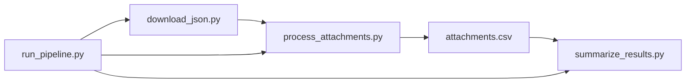

# eu-merger-cases-arbitration-analysis specification

---

## What you are building

A small **Python** project that:

1. Downloads public European Commission data about **merger cases** (JSON).
2. Finds every **PDF attachment** linked from decision data.
3. Downloads each PDF, reads the text, and searches for **arbitration-related words** (in the PDF’s language).
4. Writes **one CSV file** with all metadata plus hit/no-hit results.

**You do not need:** a database, Docker, Airflow, dbt, or a dashboard. Run three scripts manually on your computer (or use `run_pipeline.py`).

**Typical runtime:** downloading and scanning all PDFs takes **several hours** (tens of thousands of files). Use a small test limit first.

**Python:** 3.10 or newer.

**Project layout:** Python scripts live in [`src/`](../src/) (`download_json.py`, `process_attachments.py`, `summarize_results.py`, `run_pipeline.py`, `pipeline_utils.py`). Run them from the project root.

---

## Data source

### JSON download URL

```
https://compcases-open-data-portal-files-prod.s3.eu-west-1.amazonaws.com/case-data-M.json
```

Save the file locally as:

```
data/raw/case-data-M.json
```

**What it contains:** one object per merger case (keys like `M.1185`). Each case includes company names, sectors, decisions, and links to PDF documents.

**Validation after download:**

- File must parse as valid JSON.
- At least **1000** top-level case keys (guards against truncated downloads).
- Write to a temporary file first; replace the old file only when validation passes.

### JSON structure (simplified)

```
case_key (e.g. "M.1185")
└── metadata                    → case-level fields (case number, companies, sectors, …)
└── caseAttachments[]           → optional case-level attachments (NOT exported to CSV)
└── decisions[]
    └── metadata                → decision-level fields (decision type, adoption date, …)
    └── decisionAttachments[]   → PDFs belonging to this decision
        └── metadata
            ├── attachmentLink       → URL of the PDF  (required)
            ├── metadataReference    → stable id        (required)
            └── attachmentLanguage   → e.g. EN, DE, FR  (needed for keyword search)
```

**CSV grain:** one row per **`decisionAttachment`** only (one PDF), identified by `attachmentLink` + `metadataReference`.

**Out of scope for CSV rows:** `caseAttachments[]` are ignored — do not flatten them, do not keyword-scan them, and do not use a `caseAtt_` column prefix.

---

## Parsed fixed columns (from JSON metadata)

These four fixed columns are derived during flattening (not copied verbatim from dynamic columns).

### Decision type (`decision_type_code`, `decision_type_label`)

**Source:** `decisions[].metadata.decisionTypes` — a list of JSON strings.

Each list item parses as an object with `code` and `label`:

```json
{"code": "DecisionType310", "label": "Art. 6(1)(b)"}
```

**Parsing rules:**

1. For each item in `decisionTypes`, parse the string as JSON.
2. Collect all `code` values → join with ` | ` → `decision_type_code`.
3. Collect all `label` values → join with ` | ` → `decision_type_label`.
4. If `decisionTypes` is missing or empty: both columns are empty strings.

**Example** (single decision type):

| Field | Value |
|-------|-------|
| `decision_type_code` | `DecisionType310` |
| `decision_type_label` | `Art. 6(1)(b)` |

### Sector (`sector_code`, `sector_label`)

**Source:** `case.metadata.caseSectors` — a list of JSON strings (case-level, shared by all decisions in the case).

Each list item parses as an object with `code` and `label`:

```json
{"code": "NaceSectorsG_46", "label": "G.46 - Wholesale trade, except of motor vehicles and motorcycles"}
```

**Parsing rules:**

1. For each item in `caseSectors`, parse the string as JSON.
2. Collect all `code` values → join with ` | ` → `sector_code`.
3. Collect all `label` values → join with ` | ` → `sector_label`.
4. If `caseSectors` is missing or empty: both columns are empty strings.

---

## Keyword configuration

`config/keywords.txt`. Each line defines a search rule:

```
LANG: pattern
```

| Rule | Meaning |
|------|---------|
| `EN: arbitrat*` | English PDFs: match words starting with “arbitrat” (arbitration, arbitral, …) |
| `*` | Wildcard: any characters |
| `DE: Schied*:Verfahren*` | German: **both** patterns must appear (AND), separated by `:` after the language code |
| Two lines with same `LANG` | **OR** — either rule can match |
| `# comment` or blank line | Ignored |

Example lines:

```
EN: arbitrat*
FR: arbitrag*
DE: Schiedsverfahren*
```

The language code must match the PDF’s `attachmentLanguage` field (two letters, e.g. `EN`).

### Keyword file parsing grammar

For each non-blank, non-comment line:

1. Split on the **first** `:` → language code (trimmed, uppercased) and **pattern rest**.
2. Split **pattern rest** on `:` → one or more sub-patterns (AND group). Trim each sub-pattern.
3. Multiple lines with the same language code → **OR** between lines; within one line, sub-patterns are **AND**.

**Example:** `DE: Schied*:Verfahren*` → language `DE`, one AND group with sub-patterns `Schied*` and `Verfahren*`.

**No rules for a PDF language:** log a warning, set `has_keyword_hit = false`, leave `matchedKeywords` / `matchContext` empty, set `matchedLanguage` to the attachment language if known.

---

## Output: one CSV file

**Path:** `data/processed/attachments.csv`  
**Encoding:** UTF-8  
**Grain:** one row per decision PDF attachment

### Fixed columns (always first, in this order)

| Column | Description |
|--------|-------------|
| `att_attachmentLink` | PDF URL |
| `att_metadataReference` | Attachment ID |
| `has_keyword_hit` | `true` if any keyword matched, else `false` |
| `matchedKeywords` | Which patterns matched, joined with ` \| `; empty if no hit |
| `matchedLanguage` | Language used for search; empty if unknown |
| `matchContext` | 150 characters of text around the first match; empty if no hit |
| `pdf_processed_at` | ISO timestamp (UTC) when PDF processing finished |
| `pdf_processing_error` | Empty if OK; `download:…` or `processing:…` if failed |
| `decision_type_code` | Parsed code from `decisionTypes` (see above) |
| `decision_type_label` | Parsed label (e.g. `Art. 6(1)(b)`) |
| `sector_code` | Parsed sector code from `caseSectors` |
| `sector_label` | Parsed sector name |
| `is_active` | `true` if still in latest JSON; `false` if removed |

### Dynamic metadata columns (after fixed columns)

While reading the JSON, collect **all** metadata field names from case, decision, and attachment metadata and add them as columns:

| Prefix | Comes from |
|--------|------------|
| `case_` | Case metadata |
| `dec_` | Decision metadata |
| `att_` | Attachment metadata |

Rules:

- Store everything as text.
- If a value is a list, join items with ` | `.
- If a value is a nested object (not a list), serialize as a JSON string.
- New fields in future JSON releases → new columns on the next run.
- Skip rows missing `attachmentLink` or `metadataReference`.
- **No duplicate columns:** fixed columns win. When flattening attachment metadata, do **not** add dynamic `att_*` columns for keys already represented in the fixed column list (`attachmentLink`, `metadataReference`, and other fixed-derived fields).

---

## Dependencies

**File:** `requirements.txt`

```
requests>=2.31.0
pdfplumber>=0.11.0
```

Pin exact versions only if reproducibility becomes important; minimum versions above are sufficient for development.

**Standard library only otherwise:** `csv`, `json`, `logging`, `argparse`, `re`, `pathlib`, etc.

---

## Pipeline overview



| Step | Script | What it does |
|------|--------|--------------|
| 1 | `download_json.py` | Fetch JSON from S3 URL, validate, save |
| 2 | `process_attachments.py` | Flatten JSON, download PDFs, keyword scan, write CSV |
| 3 | `summarize_results.py` | Print stats, write `summary.json` |
| all | `run_pipeline.py` | Run steps 1 → 2 → 3 in order |

Each script must expose a **`if __name__ == "__main__":`** entry point so it can be run directly with `python script.py`.

Document run order in `README.md`.

### `run_pipeline.py`

Runs the full pipeline in order:

```bash
python src/run_pipeline.py
python src/run_pipeline.py --test-limit 100
python src/run_pipeline.py --retry-downloads
```

**Behaviour:**

1. Run `download_json.py` logic (or subprocess). On failure: **stop**; do not run later steps.
2. Run `process_attachments.py` with forwarded CLI flags (`--test-limit`, `--retry-downloads`).
3. Run `summarize_results.py`. On failure: **stop** and exit non-zero.

Forward any unrecognized flags to `process_attachments.py` only.

---

## Script 1: `download_json.py`

**Run:**

```bash
python src/download_json.py
```

**Behaviour:**

1. `GET` the JSON URL with `requests`.
2. Save to `data/raw/case-data-M.json.tmp`.
3. Validate JSON and case count ≥ 1000.
4. Rename temp file to `data/raw/case-data-M.json`.
5. On failure: delete temp file, keep previous file if any, log error.

**HTTP settings:** 120 s timeout; User-Agent `eu-merger-cases-arbitration-analysis/1.0`; **3 retries** with exponential backoff (1 s, 2 s, 4 s) on transient network/5xx errors.

---

## Script 2: `process_attachments.py` (main work)

**Run:**

```bash
python src/process_attachments.py
python src/process_attachments.py --test-limit 100    # smoke test: only 100 PDFs
python src/process_attachments.py --retry-downloads   # retry failed downloads
```

### Flatten JSON

For each case → each decision → each `decisionAttachment`:

- Build a flat dict of metadata (prefixes `case_`, `dec_`, `att_` only).
- Add parsed `decision_type_*` and `sector_*` columns (see **Parsed fixed columns**).
- Set `is_active = true`.

### Metadata refresh (re-run after new JSON download)

When `attachments.csv` already exists and JSON is downloaded again:

- Match rows by `(att_attachmentLink, att_metadataReference)`.
- **Overwrite** all metadata columns (`case_*`, `dec_*`, `att_*`, parsed type/sector columns) from the latest JSON.
- **Preserve** PDF result columns (`has_keyword_hit`, `matchedKeywords`, `matchedLanguage`, `matchContext`, `pdf_processed_at`, `pdf_processing_error`) when the row was already processed successfully (`pdf_processed_at` set and `pdf_processing_error` empty).
- Rows only in the old CSV → set `is_active = false`, keep row and PDF columns unchanged.

### Incremental PDF processing (no database)

If `attachments.csv` already exists, load it and index rows by `(att_attachmentLink, att_metadataReference)`.

**Run the PDF step only when:**

- `pdf_processed_at` is empty (never processed), **or**
- `--retry-downloads` is set **and** `pdf_processing_error` starts with `download:`

**Skip PDF step when:** already processed successfully (`pdf_processed_at` set, `pdf_processing_error` empty).

**Partial progress:** after merging metadata, write `attachments.csv` once. After **each** PDF is processed, rewrite the CSV atomically (via a `.tmp` file). If the run is interrupted (e.g. Ctrl+C), already-finished PDFs remain in the CSV and are skipped on the next run. A PDF interrupted mid-download (before `pdf_processed_at` is set) will be retried.

### PDF step (per attachment)

1. **Language** — read `att_attachmentLanguage`, fallback `att_language`. If missing: log warning, set `has_keyword_hit = false`, set `pdf_processed_at`, continue (no `pdf_processing_error` unless download/processing fails).
2. **Download** — `requests` with **3 retries** and exponential backoff (1 s, 2 s, 4 s), 120 s timeout, User-Agent `eu-merger-cases-arbitration-analysis/1.0`. Stream response in memory; do not cache PDFs on disk.
3. **Extract text** — `pdfplumber`, all pages, join with newlines.
4. **Keyword match** — load rules for that language from `keywords.txt` (see **Keyword file parsing grammar**):
   - Convert `*` to regex `.*`, case-insensitive.
   - AND groups: all sub-patterns must match.
   - OR: any line for that language can match.
5. **On match:** `has_keyword_hit = true`, fill `matchedKeywords`, `matchedLanguage`, `matchContext` (150 characters around earliest match, whitespace normalized).
6. **On no match:** `has_keyword_hit = false`, clear match fields.
7. **On error:** set `pdf_processing_error` to `download: …` or `processing: …`; still set `pdf_processed_at`.
8. Optional delay: `REQUEST_DELAY_SECONDS` between requests (politeness).
9. **Progress:** log at INFO when each PDF starts (`Processing PDF N/M: metadataReference`). Every **100** PDFs, log a summary line with counts and elapsed time so far.
10. **Completion:** log total PDF processing time in the final summary line (`Processed PDFs: N | Hits: H | Errors: E | Time: …`).

### After processing

- Rows in old CSV but not in new JSON → set `is_active = false`, keep row.
- CSV is written after metadata merge and after each PDF (see **Partial progress** above); final write uses fixed columns + sorted dynamic columns.

### End-of-run message

```
Processed PDFs: N | Hits: H | Errors: E | Time: 1h 23m 45s
```

If `E > 0`, also print: `Some downloads failed — re-run with --retry-downloads`

### Flags and environment variables

| Flag / env | Default | Purpose |
|------------|---------|---------|
| `--test-limit N` | none | Process at most N PDFs **this run** (counts only PDFs actually processed, not skipped rows) |
| `TEST_LIMIT` | none | Same as `--test-limit` |
| `--retry-downloads` | off | Retry rows with `download:` errors |
| `RETRY_DOWNLOAD_ERRORS=1` | off | Same as `--retry-downloads` |
| `REQUEST_DELAY_SECONDS` | `0` | Seconds to wait between PDF downloads |

### Logging

Use stdlib `logging` at **INFO** level by default. Every warning/error must include the attachment URL or `att_metadataReference` so the row can be found in the CSV.

---

## Script 3: `summarize_results.py`

**Run:**

```bash
python src/summarize_results.py
```

Reads `attachments.csv` only. Prints a report to stdout and writes `data/processed/summary.json`.

### `relevant_art6_art8` matching

A row counts as **relevant** when `decision_type_label` contains **`6(1)(b)`** or **`8(2)`** (substring match, case-sensitive). This includes labels such as `Art. 6(1)(b) with conditions & obligations` and `Art. 8(2)`.

### Console report

Print one line per metric (human-readable), then the path to the JSON file:

```
total_attachments: 12345
active_attachments: 12000
...
Summary written to data/processed/summary.json
```

### `summary.json` schema

UTF-8 JSON object with these fields:

| Field | Type | Meaning |
|-------|------|---------|
| `total_attachments` | integer | All rows in CSV |
| `active_attachments` | integer | Rows with `is_active = true` |
| `pdf_processed` | integer | Rows with non-empty `pdf_processed_at` |
| `pdf_errors` | integer | Rows with non-empty `pdf_processing_error` |
| `keyword_hits` | integer | Rows with `has_keyword_hit = true` |
| `relevant_art6_art8` | integer | Rows matching rule above |
| `hits_in_relevant` | integer | Keyword hits within the relevant subset |
| `top_matched_keywords` | array | Top **10** `matchedKeywords` values among hits; each item `{"keyword": "...", "count": N}`; sorted by count descending |
| `generated_at` | string | ISO timestamp (UTC) when summary was built |

---

## Error handling

- One broken PDF must **not** stop the whole run.
- Save errors in `pdf_processing_error` on that row.
- Log enough context to find the row (URL or metadata reference).
- No automated alerts — read the console log and `summary.json`.
- Corrupt PDFs → `processing:…`; only retry downloads with `--retry-downloads`, not processing errors.

---

## How to run (first time)

```bash
# 1. Create virtual environment (use .venv)
python -m venv .venv

# 2. Activate (pick your OS)
# Linux / macOS:
source .venv/bin/activate
# Windows PowerShell:
.venv\Scripts\Activate.ps1

# 3. Install dependencies
pip install -r requirements.txt

# 4. Add config/keywords.txt (see Keyword configuration above)

# 5. Run pipeline
python src/run_pipeline.py --test-limit 10   # small test first

# Or step by step:
python src/download_json.py
python src/process_attachments.py --test-limit 10
python src/summarize_results.py

# 6. Full run (hours)
python src/download_json.py                         # refresh JSON
python src/process_attachments.py                   # all remaining PDFs
python src/summarize_results.py
```

**Updating later:** run `download_json.py` again, then `process_attachments.py`. Metadata refreshes for all rows; only new or failed PDFs are downloaded.

---

## Files to ignore (`.gitignore`)

At minimum:

```
.venv/
venv/
__pycache__/
*.pyc
data/raw/*.json
data/processed/*.csv
data/processed/summary.json
```

---

## Suggested implementation order

Build and test in layers:

1. `download_json.py` — confirm JSON on disk.
2. `process_attachments.py` without PDFs — flatten JSON, write CSV with metadata only.
3. Add PDF download + keyword matching.
4. Add CSV-as-state, `--retry-downloads`, `--test-limit`, `is_active`.
5. `summarize_results.py`.
6. `run_pipeline.py`.

---
